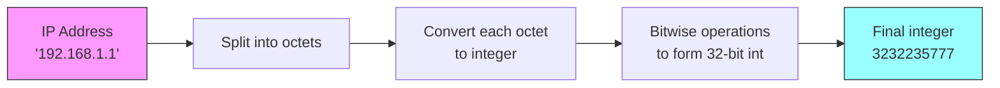
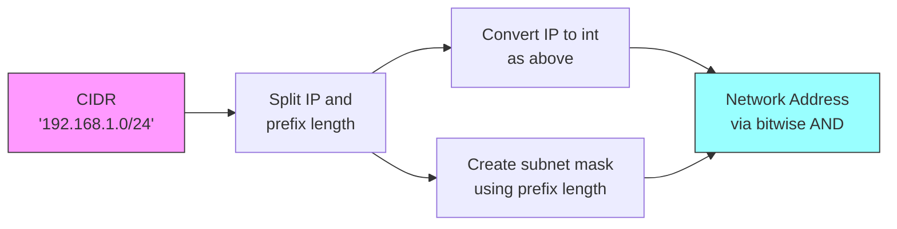
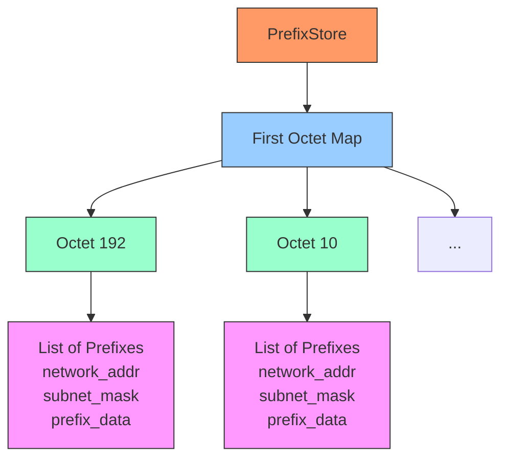
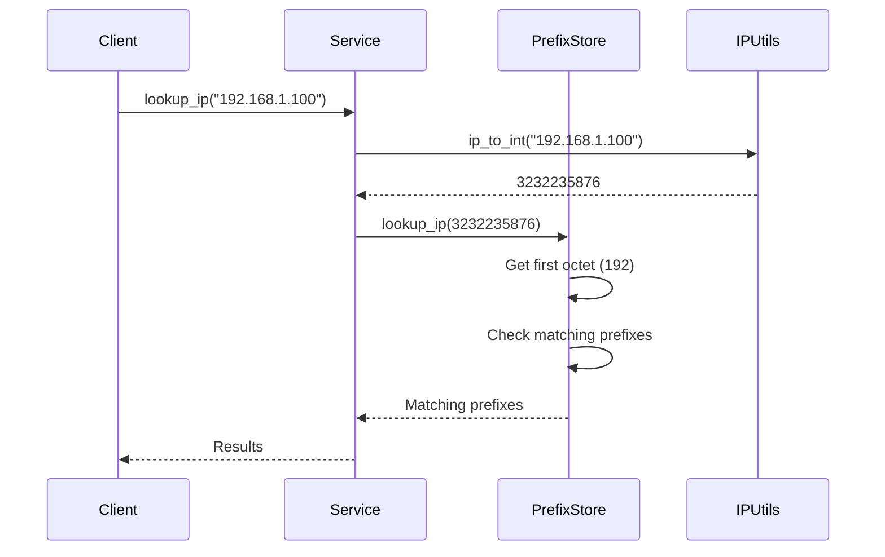

# High-Performance IP Prefix Lookup Service

A lightning-fast IP prefix lookup service implemented using bitwise operations and optimized data structures. This service efficiently determines which network prefixes (subnets) contain a given IP address.

## 🌟 Key Features

- Pure Python implementation with no external IP address dependencies
- Optimized prefix lookup using bitwise operations
- First-octet bucketing for rapid prefix filtering
- Support for both single IP and batch lookups
- ~O(1) average lookup time complexity
- Comprehensive test suite with performance benchmarks

## Installation
1. Clone the repository:
bash
git clone https://github.com/yourusername/ip-prefix-lookup.git
cd ip-prefix-lookup

2. Create a virtual environment and activate it:
```bash
python -m venv venv
source venv/bin/activate
```
3. Install dependencies:
```bash

pip install -r requirements.txt
```

## Usage

1. Start the FastAPI server:

```bash
uvicorn src.main:app --reload
```

2. Access the API documentation at `http://localhost:8000/docs`

### API Endpoints

- `GET /lookup/{ip}` - Look up a single IP address
- `POST /lookup/batch` - Look up multiple IP addresses


## 🔍 How It Works

### IP Address & CIDR Processing



### CIDR Subnet Parsing



### Prefix Store Data Structure



### Lookup Process Flow



## 🔧 Technical Implementation

### Bitwise Operations

The service uses efficient bitwise operations for all IP address manipulations:

1. **IP to Integer Conversion**:
   ```python
   def ip_to_int(ip: str) -> int:
       result = 0
       for part in ip.split('.'):
           result = (result << 8) | int(part)
       return result
   ```

2. **Subnet Mask Creation**:
   ```python
   def create_mask(prefix_len: int) -> int:
       return ((1 << 32) - 1) << (32 - prefix_len)
   ```

3. **Subnet Membership Test**:
   ```python
   def is_ip_in_subnet(ip: int, network: int, mask: int) -> bool:
       return (ip & mask) == network
   ```

### Performance Optimization Techniques

1. **First Octet Bucketing**
   - IPs are grouped by their first octet (e.g., 192 in 192.168.1.1)
   - Provides immediate filtering of irrelevant prefixes
   - Reduces the search space by ~256x in typical cases

2. **Integer-based Comparisons**
   - All IP addresses stored as 32-bit integers
   - Enables fast bitwise operations instead of string manipulation
   - Reduces memory usage compared to string storage

3. **Minimal Memory Footprint**
   - Uses compact data structures
   - Avoids redundant storage of prefix information
   - Efficient memory-to-performance trade-off

## 📊 Performance Characteristics

| Operation | Average Time | Worst Case |
|-----------|--------------|------------|
| Single IP Lookup | O(k) | O(n) |
| Batch IP Lookup | O(k*m) | O(n*m) |
| Add Prefix | O(1) | O(1) |

Where:
- n = total number of prefixes
- k = average prefixes per first-octet bucket
- m = number of IPs in batch lookup

## 🚀 Usage

### Basic Usage

```python
from src.infrastructure.prefix_store import PrefixStore
from src.domain.models import IPPrefix

# Initialize the store
store = PrefixStore()

# Add a prefix
prefix = IPPrefix(
    subnet="192.168.1.0/24",
    provider="aws",
    tags=["production", "web"]
)
store.add_prefix(prefix)

# Lookup an IP
results = store.lookup_ip("192.168.1.100")
```

### Batch Processing

```python
# Batch lookup
ips = [
    "192.168.1.100",
    "192.168.1.101",
    "10.0.0.1"
]
results = [store.lookup_ip(ip) for ip in ips]
```

## 🧪 Testing

Run the test suite:
```bash
pytest
```

Run performance benchmarks:
```bash
pytest tests/benchmarks/
```

## 📈 Benchmarks

| Test Case | Time (ms) | Memory (MB) |
|-----------|-----------|-------------|
| Single IP | < 0.1 | < 1 |
| 100 IPs | < 5 | < 1 |
| 10k Prefixes | < 50 | ~ 10 |
